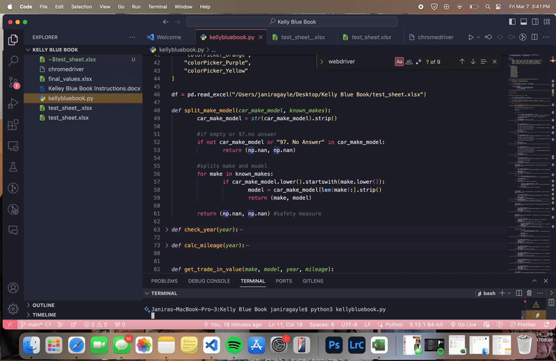

# Kelley Blue Book Automation Tool  

This automation tool was originally developed for [**CPSP at Columbia University**](https://povertycenter.columbia.edu/people/janira-esperanza-gayle) to efficiently retrieve car values for a large set of survey participants.  

## 📌 How It Works  
- The tool processes an **Excel sheet** containing survey participants' **IDs**, along with their **car make, model, and year**.  
- It **automatically inputs** this information into the [Kelley Blue Book](https://www.kbb.com/whats-my-car-worth/) website.  
- The retrieved **car value** is then exported alongside the corresponding **participant ID**.  

## 🔧 Requirements  
- **Python** and **Selenium** must be installed.  
- **Safari WebDriver** is built into macOS but must be enabled.  

## 🚀 How to Run  
1. Download the appropriate `.py` file.  
2. Ensure your **Excel sheet is correctly formatted** (a test sheet is provided).  
3. Enable **Remote Automation** for Safari:  
   - Open **Safari** → Go to **Develop** → Select **Allow Remote Automation**  
4. Open a terminal and run:  
   ```sh
   python kellybluebook.py




